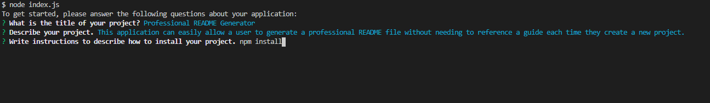

# Professional README Generator
  [](https://opensource.org/licenses/MIT)
  ## Description

  This application can easily allow a user to generate a professional README file without needing to reference a guide each time they create a new project.

  It was written in JavaScript for Node.js and uses the Inquirer package.

  ## Table of Contents

  * [Installation](#installation)
  * [Usage](#usage)
  * [Credits](#credits)
  * [License](#license)
  * [Questions](#questions)

  ## Installation
  
  To install dependencies, type the following:
  ```md
  npm install
  ```

  ## Usage

  The user will type the following to run the README generator:
  ```md
  node index.js
  ```
  Then, the user will follow all of the provided prompts, and when they are done, they will be able to use the README generated for them in their repository.

  

  Navigate to [the video](https://drive.google.com/file/d/1UoMx6IR5M0htshSIMk7l3kfyXcpW8rh-/view) to see how the application works.

  ## Credits

  Created by [Soma Makela](https://github.com/smakela13).
  
  Uses [Screencastify](https://app.screencastify.com/) for video recording.

  ## License

  This application is licensed under MIT License. Click the badge for more information on how you can use this project.
  <br>

  [](https://opensource.org/licenses/MIT)

  ## Questions
  If you have any questions, feel free to reach out to me at smakela.now@gmail.com.
